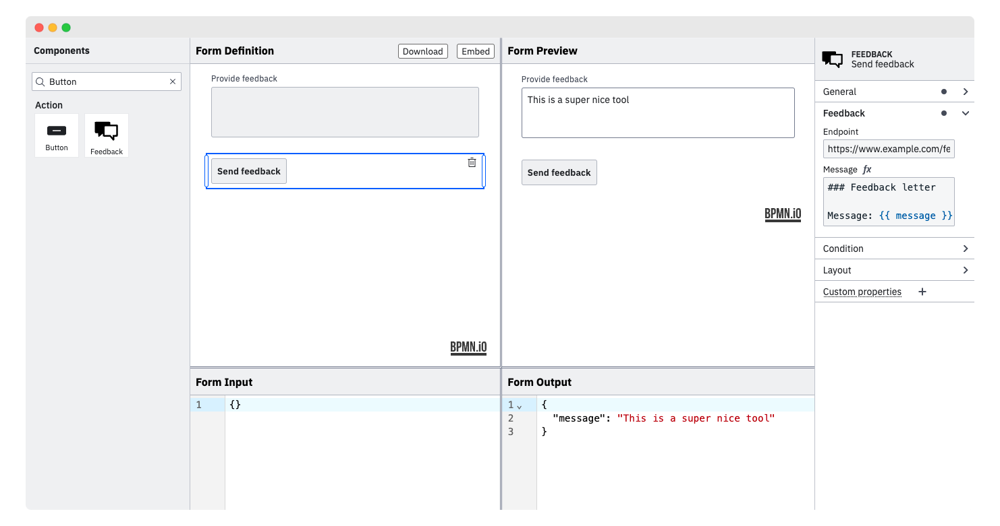

# form-js Custom Button Example

This example uses [form-js](https://github.com/bpmn-io/form-js) to implement a custom button component.



## About

This example builds on the general [custom components example](./../custom-components).

It demonstrates how to implement a custom feedback button component that triggers a custom behavior on click. Furthermore, it shows how to use the form-js [FEEL tooling](https://docs.camunda.io/docs/components/modeler/feel/what-is-feel/) to make the feedback message dynamic.

## Building

You need a [NodeJS](http://nodejs.org) development stack with [npm](https://npmjs.org) installed to build the project.

To install all project dependencies execute

```
npm install
```

Spin up a development setup by executing

```
npm run dev
```